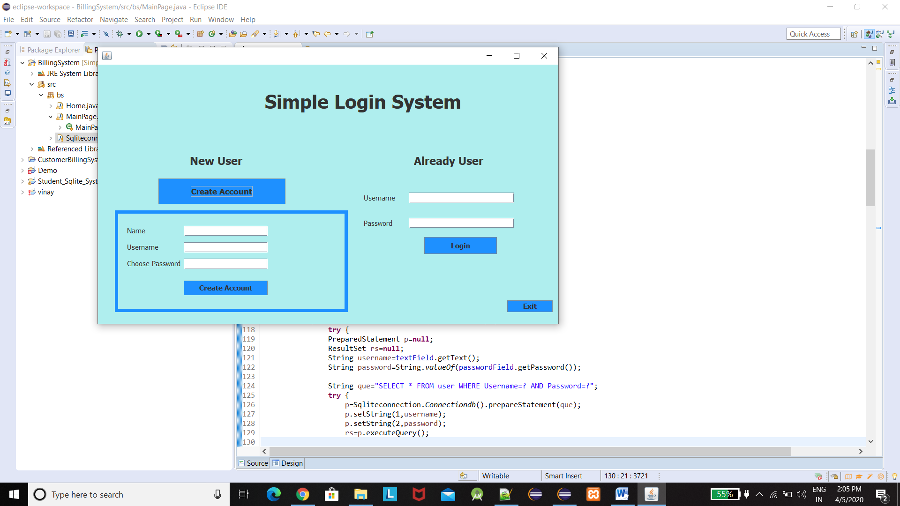

# SimpleLoginSystem
Simple Login System 
This is the simple login system where user can first register himself 
And then he can login into the system this login system can be included in any system application 
**Note**-phpmyadmin is used for connectivity 
**Screenshots-** 

